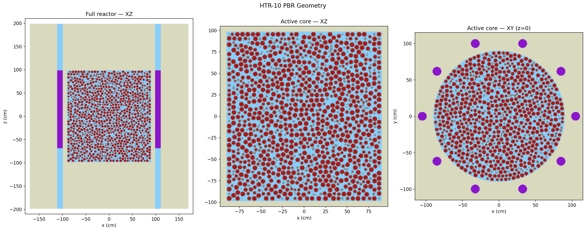
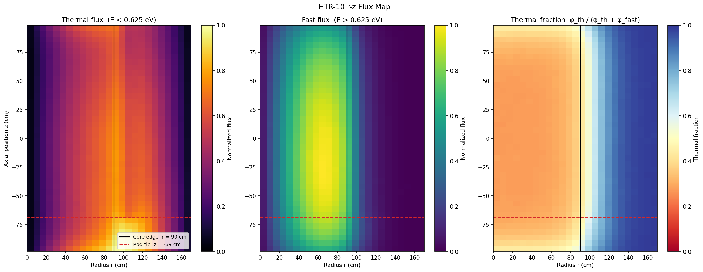
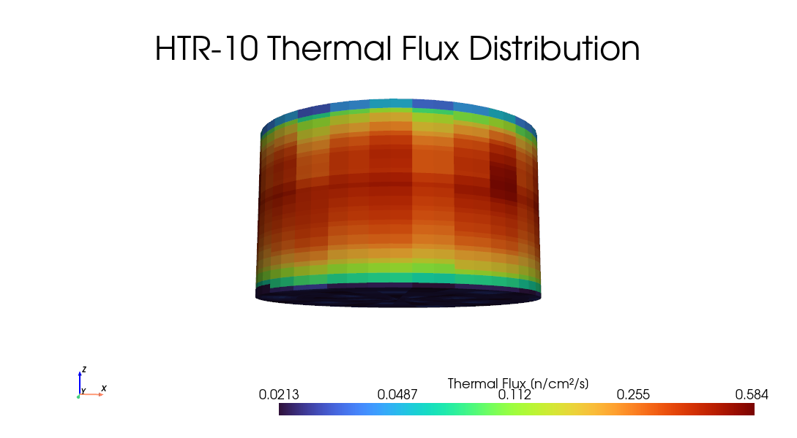
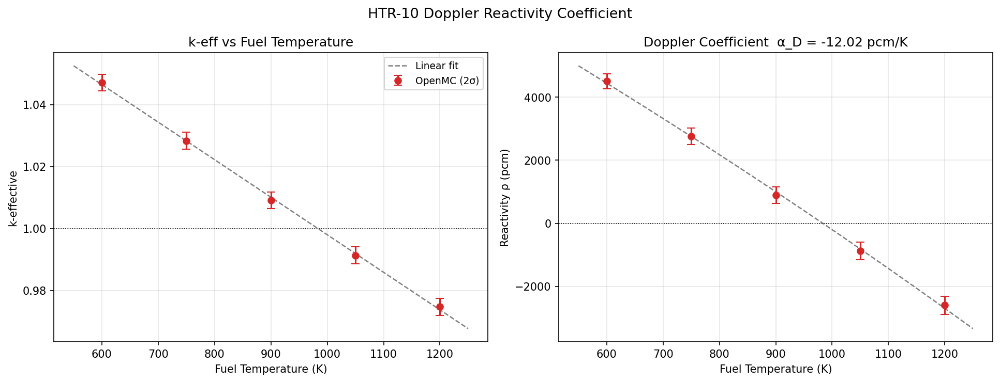
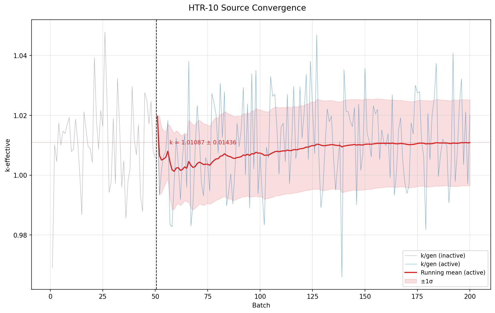

# HTR-10 Pebble Bed Reactor — OpenMC Criticality & Safety Analysis

A full-core Monte Carlo model of the HTR-10 prototype pebble bed 
reactor developed in OpenMC, computing criticality, spatial flux 
distribution, and Doppler reactivity coefficient.

The HTR-10 is a 10 MWth helium-cooled pebble bed reactor developed 
by Tsinghua University and a key reference design for modern 
high-temperature gas-cooled reactor (HTGR) development. Pebble bed 
reactors are of significant current interest, with designs like 
X-energy's Xe-100 drawing directly on HTGR heritage.

## Model Description

### Geometry
- 27,000 discrete fuel pebbles packed into a cylindrical core
- Pebble packing fraction: ≥ 0.6
- Full reactor model including graphite reflector and control 
  rod positions
- Three geometry views computed: full reactor XZ, active core 
  XZ, and active core XY (z=0)

### Fuel Treatment
Each pebble contains a TRISO particle lattice. The fuel within 
each pebble is modeled as homogeneous — a deliberate simplification 
that dramatically reduces computation time on consumer hardware 
while preserving the core neutron transport physics. This 
simplification results in a known positive bias on keff and an 
elevated Doppler coefficient magnitude relative to explicit 
TRISO modeling.

### Materials & Conditions
- Fuel: UO₂ TRISO particles in graphite matrix
- Coolant/moderator: helium and graphite
- Cross section library: ENDF/B-VIII.0

### Simulation Parameters
- 50 inactive generations for fission source convergence
- 150 active generations
- Thermal (E < 0.625 eV) and fast (E > 0.625 eV) flux 
  tallied via r-z mesh

## Results

### Criticality
**keff = 1.01087 ± 0.01436**

The larger uncertainty relative to the AP1000 model reflects 
the stochastic pebble packing geometry and reduced particle 
count per generation — a known characteristic of pebble bed 
Monte Carlo calculations.

### Spatial Flux Distribution
R-z flux maps computed for thermal and fast energy groups:
- Thermal flux peaks at core center, attenuates toward 
  reflector boundary
- Fast flux peaks near core center with steep radial gradient
- Thermal fraction drops sharply beyond the core edge (r = 90 cm),
  confirming effective neutron thermalization within the pebble bed

### Doppler Reactivity Coefficient
Fuel temperature varied from 600 K to 1200 K in five steps.

**Doppler coefficient αD = −12.02 pcm/K**

The strong negative Doppler coefficient is a defining safety 
feature of HTGR designs — as fuel temperature rises, resonance 
absorption in ²³⁸U increases, reducing reactivity and providing 
inherent passive shutdown capability. This result confirms the 
model captures the correct temperature-dependent neutronics 
behavior.

## Limitations
- Homogeneous fuel treatment within each pebble introduces a 
  positive bias on keff relative to explicit TRISO modeling
- Homogeneous treatment also elevates the Doppler coefficient 
  magnitude due to overestimated resonance self-shielding
- Stochastic pebble packing produces run-to-run geometry 
  variation; results reflect a single packing realization

## Tools & Libraries
- [OpenMC](https://openmc.org) Monte Carlo particle transport code
- ENDF/B-VIII.0 nuclear data library
- Python (model construction, post-processing, visualization)

## Author
Eric Yokie | [LinkedIn](https://www.linkedin.com/in/ericyokie/)
